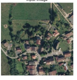
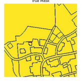
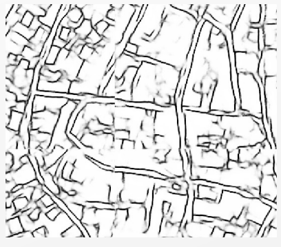

# Overview

This project implements an image segmentation pipeline using a U-Net model with TensorFlow. It includes the preprocessing of images and masks, data augmentation, training the model, and making predictions. The model is designed to perform semantic segmentation, which is ideal for tasks like satellite image analysis, medical image segmentation, and other applications where pixel-wise classification is required.
The only input was RGB image.

# Key Features

- Data Preprocessing: Reads and processes input images and masks, normalizing them and preparing them for training.
- Data Augmentation: Optionally augments training data through random transformations to improve model generalization.
- Model Training: Trains a U-Net model, with the option to load pre-trained weights and save the best model during training.
- Model Prediction: Uses the trained model to generate segmentation masks for new images.
- Visualization: Displays the input images, true masks, and predicted masks for visual assessment of the model's performance.

# Improvement:
- Overlaping of the tiles.
- use of more data, as depth level and IR
- Post-posprocessing tiles to fuse the Overlaping tiles and clean the othes lines with closest neighbour or something.

# Data

The input: 	

The mask: 	

The result: 